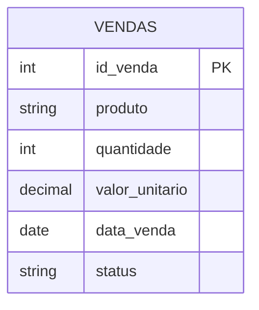
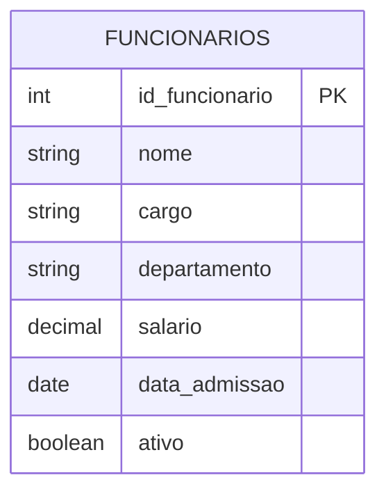

# Comparação: Delta Lake vs Apache Iceberg

Este documento apresenta uma comparação entre Delta Lake e Apache Iceberg, destacando suas principais características e diferenças.

## Visão Geral

| Característica           | Delta Lake                            | Apache Iceberg |
| ------------------------ | ------------------------------------- | -------------- |
| Criador                  | Databricks                            | Netflix        |
| Licença                  | Proprietário (com versão open source) | Apache 2.0     |
| Integração com Spark     | Nativa                                | Nativa         |
| Suporte a ACID           | Sim                                   | Sim            |
| Time Travel              | Sim                                   | Sim            |
| Schema Evolution         | Sim                                   | Sim            |
| Partition Evolution      | Sim                                   | Sim            |
| Hidden Partitioning      | Não                                   | Sim            |
| Multi-table Transactions | Sim                                   | Sim            |

## Modelos de Dados

### Delta Lake - Modelo de Vendas

### Iceberg - Modelo de Funcionários

## Casos de Uso Recomendados

### Delta Lake

- Projetos que já utilizam o ecossistema Databricks
- Necessidade de integração com ferramentas Databricks
- Projetos que priorizam simplicidade de configuração
- Ambientes que utilizam principalmente Spark

### Apache Iceberg

- Projetos que necessitam de maior flexibilidade de particionamento
- Ambientes multi-engine (Spark, Flink, Presto, etc.)
- Necessidade de maior controle sobre o formato de armazenamento
- Projetos que priorizam padrões abertos

## Performance

### Delta Lake

- Otimizações automáticas para consultas Spark
- Melhor performance em ambientes Databricks
- Suporte a otimizações de arquivos (OPTIMIZE)

### Apache Iceberg

- Melhor performance em ambientes multi-engine
- Otimizações de particionamento mais flexíveis
- Suporte a diferentes formatos de arquivo

## Considerações de Escolha

1. **Ecosystem**: Se você já usa Databricks, Delta Lake pode ser mais conveniente
2. **Flexibilidade**: Iceberg oferece mais flexibilidade em termos de engines e formatos
3. **Licenciamento**: Iceberg é totalmente open source, enquanto Delta Lake tem versões proprietárias
4. **Performance**: Ambos oferecem excelente performance, mas em contextos diferentes
5. **Comunidade**: Iceberg tem uma comunidade mais diversificada, enquanto Delta Lake tem forte suporte da Databricks
