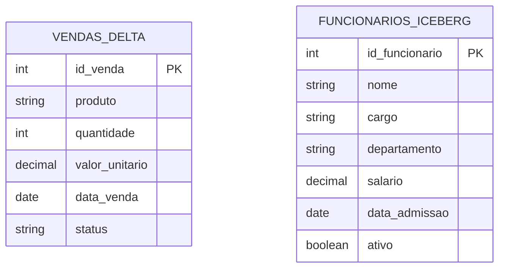
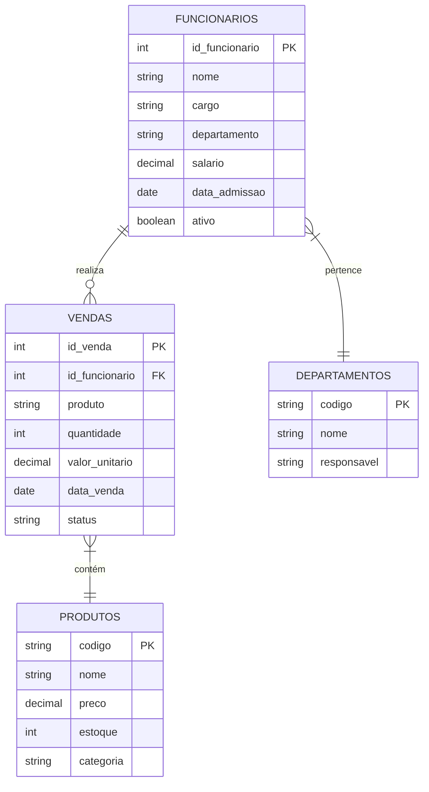

# Modelo ER - Relações entre as Tabelas

Esta página apresenta o modelo Entidade-Relacionamento (ER) que representa a estrutura dos dados utilizados nos exemplos com Delta Lake e Apache Iceberg.

## Diagrama ER

O diagrama abaixo mostra as duas principais tabelas utilizadas nos nossos notebooks: `vendas_delta` e `funcionarios_iceberg`.



## Descrição das Tabelas

### Tabela `vendas_delta` (Delta Lake)

Esta tabela armazena informações sobre vendas de produtos e é mantida no formato Delta Lake.

| Coluna | Tipo | Descrição |
|--------|------|-----------|
| id_venda | INT | Identificador único da venda (Chave Primária) |
| produto | STRING | Nome do produto vendido |
| quantidade | INT | Quantidade vendida do produto |
| valor_unitario | DECIMAL(10,2) | Valor unitário do produto |
| data_venda | DATE | Data em que a venda foi realizada |
| status | STRING | Status da venda: CONCLUIDO, PENDENTE ou CANCELADO |

#### Características:
- O campo `valor_unitario` multiplicado por `quantidade` representa o valor total da venda
- O campo `status` permite acompanhar o ciclo de vida da venda
- Cada venda é identificada unicamente pelo `id_venda`

### Tabela `funcionarios_iceberg` (Apache Iceberg)

Esta tabela armazena informações sobre funcionários e é mantida no formato Apache Iceberg.

| Coluna | Tipo | Descrição |
|--------|------|-----------|
| id_funcionario | INT | Identificador único do funcionário (Chave Primária) |
| nome | STRING | Nome completo do funcionário |
| cargo | STRING | Cargo atual do funcionário |
| departamento | STRING | Departamento ao qual o funcionário pertence |
| salario | DECIMAL(10,2) | Salário atual do funcionário |
| data_admissao | DATE | Data de admissão do funcionário |
| ativo | BOOLEAN | Indica se o funcionário está ativo (true) ou inativo (false) |

#### Características:
- O campo `ativo` permite filtrar funcionários ativos/inativos
- O `departamento` permite agrupar funcionários em categorias organizacionais
- A `data_admissao` possibilita análises temporais

## Modelo ER Estendido (Conceitual)

Em um cenário real, poderíamos expandir este modelo para estabelecer relacionamentos entre as tabelas. Por exemplo:



Neste modelo estendido:
- Um funcionário pode realizar múltiplas vendas
- Uma venda é associada a um único funcionário
- Uma venda se refere a um único produto (simplificado)
- Um funcionário pertence a um único departamento

## Particionamento e Otimização

### Estratégia de Particionamento para `vendas_delta`

Para um cenário de produção, seria recomendado particionar os dados de vendas:

```sql
CREATE TABLE vendas_delta (
    id_venda INT,
    produto STRING,
    quantidade INT,
    valor_unitario DECIMAL(10,2),
    data_venda DATE,
    status STRING
) USING delta
PARTITIONED BY (data_venda)
```

Essa abordagem otimizaria consultas baseadas em períodos, como relatórios mensais ou trimestrais.

### Estratégia de Particionamento para `funcionarios_iceberg`

Para a tabela de funcionários, um possível particionamento seria:

```sql
CREATE TABLE local.funcionarios_iceberg (
    id_funcionario INT,
    nome STRING,
    cargo STRING,
    departamento STRING,
    salario DECIMAL(10,2),
    data_admissao DATE,
    ativo BOOLEAN
) USING iceberg
PARTITIONED BY (departamento)
```

Isso otimizaria análises por departamento, como cálculos de folha de pagamento ou orçamentos departamentais.

## Diferenças de Implementação

| Aspecto | Delta Lake | Apache Iceberg |
|---------|------------|---------------|
| Referência à tabela | `vendas_delta` | `local.funcionarios_iceberg` |
| Formato de data | `'2024-01-15'` | `DATE '2023-01-15'` |
| Valores booleanos | N/A | `true` ou `false` |
| Metadados | `DESCRIBE HISTORY` | `.snapshots`, `.files`, `.history` |

Estas diferenças sintáticas refletem as particularidades de cada formato no contexto do Apache Spark.