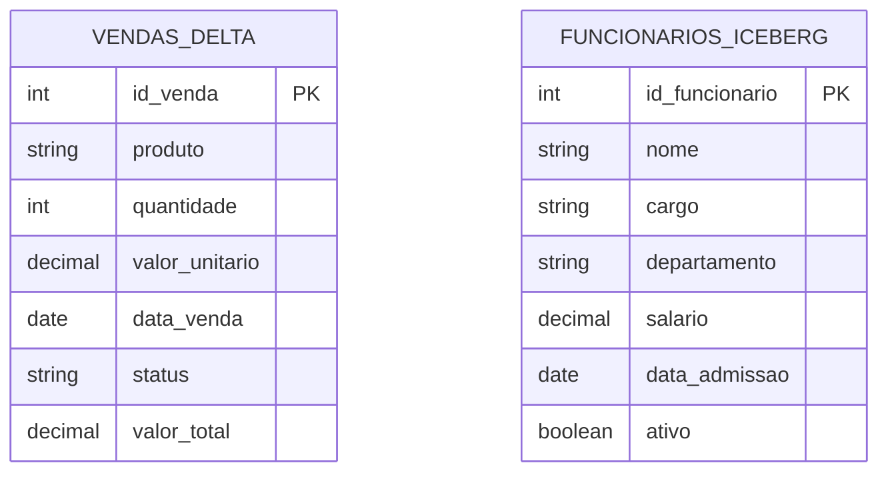
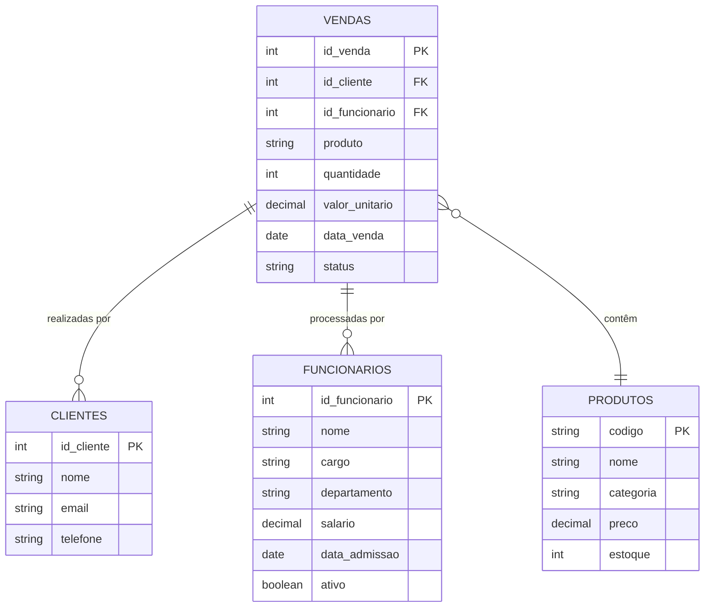
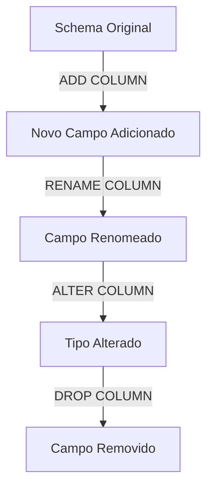

# Diagrama ER - Modelo de Dados

Esta página apresenta o modelo de dados utilizado nos exemplos de Delta Lake e Apache Iceberg.

## Visão Geral

Os notebooks de exemplo utilizam duas tabelas principais que podem ser representadas no seguinte diagrama ER:

## Descrição das Tabelas

### Tabela `vendas_delta`

Esta tabela é usada nos exemplos de Delta Lake para armazenar informações sobre vendas de produtos.

| Coluna | Tipo | Descrição |
|--------|------|-----------|
| id_venda | INT | Identificador único da venda (Chave Primária) |
| produto | STRING | Nome do produto vendido |
| quantidade | INT | Quantidade vendida do produto |
| valor_unitario | DECIMAL(10,2) | Valor unitário do produto |
| data_venda | DATE | Data em que a venda foi realizada |
| status | STRING | Status da venda (CONCLUIDO, PENDENTE, CANCELADO) |
| valor_total | DECIMAL(10,2) | Coluna calculada (quantidade * valor_unitario) |

#### Possíveis Particionamentos

Esta tabela pode ser particionada de forma eficiente por:
- `data_venda` - Para consultas baseadas em períodos específicos
- `status` - Para consultas filtradas por status da venda

### Tabela `funcionarios_iceberg`

Esta tabela é usada nos exemplos de Apache Iceberg para armazenar informações sobre funcionários.

| Coluna | Tipo | Descrição |
|--------|------|-----------|
| id_funcionario | INT | Identificador único do funcionário (Chave Primária) |
| nome | STRING | Nome completo do funcionário |
| cargo | STRING | Cargo atual do funcionário |
| departamento | STRING | Departamento ao qual o funcionário está associado |
| salario | DECIMAL(10,2) | Salário atual do funcionário |
| data_admissao | DATE | Data de admissão do funcionário |
| ativo | BOOLEAN | Indica se o funcionário está ativo (true) ou inativo (false) |

#### Possíveis Particionamentos

Esta tabela pode ser particionada de forma eficiente por:
- `departamento` - Para consultas agregadas por departamento
- `ativo` - Para separar funcionários ativos e inativos
- `data_admissao` - Para análises temporais de contratação

## Relacionamentos e Extensões

Embora os exemplos atuais não implementem relacionamentos entre as tabelas, em um cenário real poderia haver diversas conexões, como:

Este modelo estendido poderia aproveitar os recursos tanto do Delta Lake quanto do Iceberg para implementar um data lake completo para um cenário de e-commerce ou vendas.

## Considerações sobre Desempenho

Tanto o Delta Lake quanto o Apache Iceberg oferecem recursos para otimizar o desempenho das consultas no modelo de dados:

1. **Particionamento inteligente**: Particionar por colunas de alta cardinalidade que são frequentemente usadas em filtros
2. **Z-Ordering (Delta)** e **Sorting (Iceberg)**: Organizar os dados fisicamente para melhorar a localidade de leitura
3. **Compactação de arquivos**: Consolidar arquivos pequenos para reduzir a sobrecarga de I/O
4. **Estatísticas de coluna**: Ambos armazenam estatísticas para pular arquivos irrelevantes durante consultas

## Schema Evolution

Uma das vantagens destes formatos é a capacidade de evoluir o esquema ao longo do tempo:

Isso permite que as tabelas evoluam sem causar problemas de compatibilidade com versões anteriores dos dados.