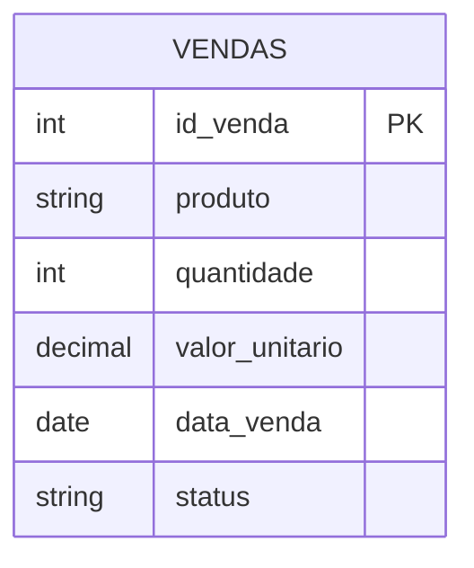
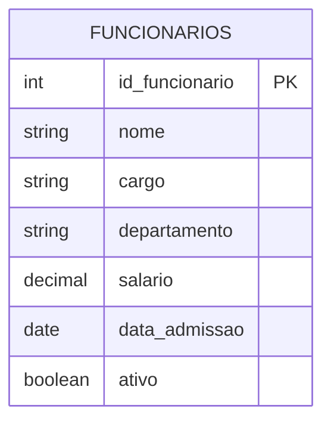

# Apache Spark com Delta Lake e Apache Iceberg

Bem-vindo à documentação do projeto de demonstração do Apache Spark com Delta Lake e Apache Iceberg. Este projeto tem como objetivo mostrar as principais funcionalidades e diferenças entre essas duas tecnologias de gerenciamento de dados.

## Visão Geral

Este projeto contém exemplos práticos de como utilizar o Apache Spark em conjunto com:

- Delta Lake: Uma camada de armazenamento que traz ACID transactions ao seu data lake
- Apache Iceberg: Uma tabela aberta para análise de big data

## Estrutura do Projeto

- `spark-delta.ipynb`: Notebook com exemplos usando Delta Lake
- `spark-iceberg.ipynb`: Notebook com exemplos usando Apache Iceberg

## Modelos de Dados

### Delta Lake - Modelo de Vendas

### Iceberg - Modelo de Funcionários

## Começando

Para começar a explorar os exemplos, navegue pelas seções:

- [Delta Lake](examples/delta-lake.md)
- [Iceberg](examples/iceberg.md)
